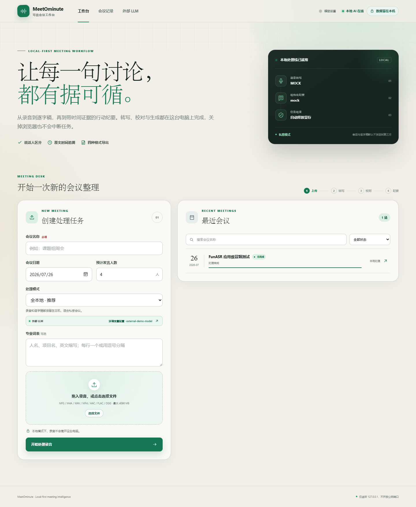
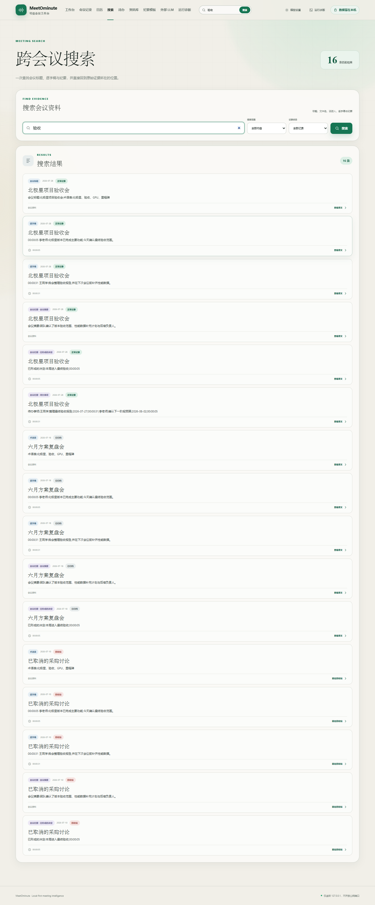
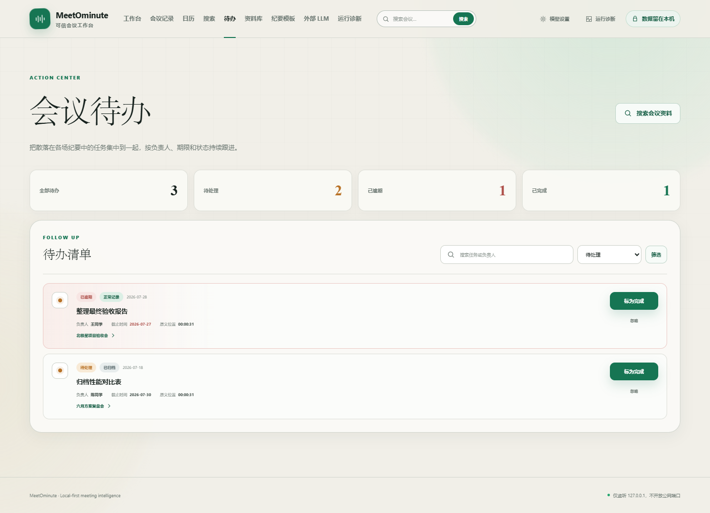
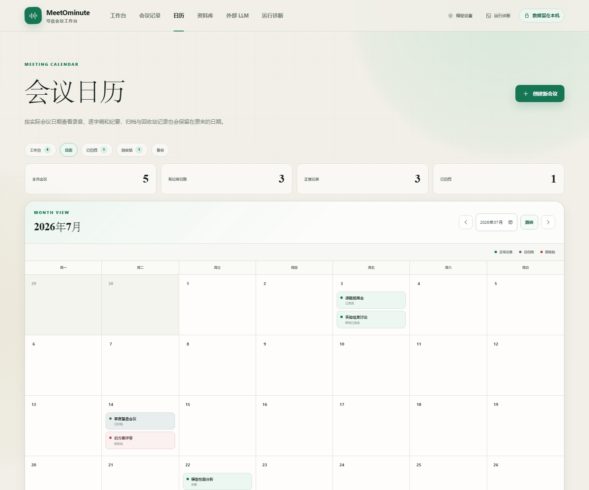
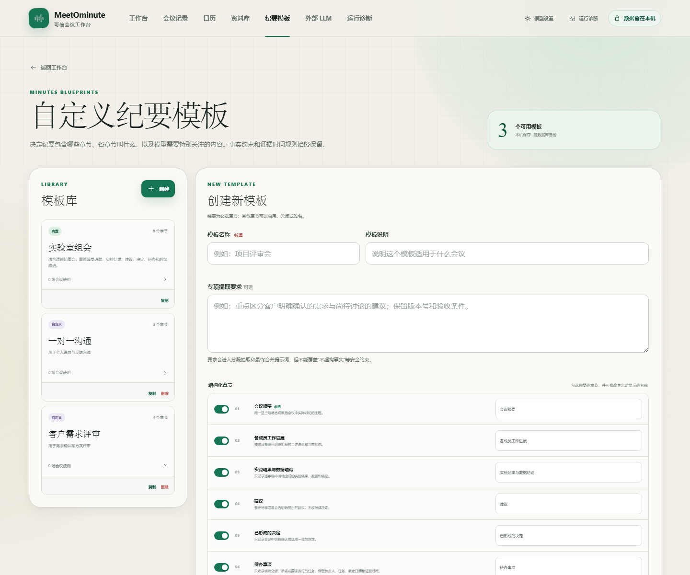

# MeetOminute

> 本地优先的中文会议录音转写、纪要生成与会议资料管理工具。

[](https://github.com/salty-yv/meetominute/actions/workflows/tests.yml)


MeetOminute 把一次会议从“录音文件”整理成可长期管理的资料：

**上传录音 → 音频标准化 → 语音转写 → 人工校正 → 生成纪要 → 跟进待办 → 搜索、导出和备份**

项目以本地使用为第一目标。录音、逐字稿、纪要、任务状态和模板默认都保存在自己的电脑中；需要时也可以接入 OpenAI 兼容的外部转写或大语言模型接口。

<p align="center">
  
</p>

## 项目简介

很多会议转写工具只解决“把声音变成文字”，但会议结束后还需要继续整理说话人、确认结论、跟进事项、查找历史内容并做好备份。MeetOminute 将这些环节放进同一个浏览器工作台中。

它适合以下场景：

- 个人访谈、课程录音、研究讨论和实验室组会
- 希望录音和逐字稿尽量不离开本机的用户
- 需要自定义会议纪要格式的团队
- 需要按日期、关键词和行动项管理大量会议记录的用户
- 希望在本地模型与外部 API 之间自由切换的用户

当前版本优先适配 Windows 10/11，并围绕中文会议完成了 FunASR、Ollama、CUDA 和 OpenAI 兼容接口的整合。

## 主要功能

| 模块 | 能力 |
| --- | --- |
| 录音处理 | 支持常见音频文件上传，通过 FFmpeg 统一转换为 16 kHz 单声道 WAV |
| 中文转写 | 支持 FunASR 本地转写、OpenAI 兼容转写接口和用于体验流程的 Mock 后端 |
| 说话人整理 | 支持说话人聚类、姓名映射、按说话人筛选以及点击时间回听原音 |
| 会议纪要 | 支持 Ollama 本地模型、OpenAI 兼容外部 LLM、长会议分段抽取与多层归并 |
| 自定义模板 | 可控制纪要章节、章节名称、额外章节和每个章节的提取要求 |
| 全文搜索 | 跨会议搜索标题、日期、文件名、术语、说话人、逐字稿和纪要 |
| 待办中心 | 汇总全部会议行动项，识别逾期事项，支持完成、忽略和重新打开 |
| 日历管理 | 按会议日期查看记录、待处理数量和逾期数量 |
| 资料库 | 支持归档、取消归档、回收站恢复和二次确认后的永久删除 |
| 导出 | 支持逐字稿 TXT，以及纪要 Word、Markdown、TXT 和 JSON |
| 备份恢复 | 创建 ZIP 一致性快照，并以不覆盖现有会议的方式合并恢复 |
| 稳定性 | 后台任务队列、阶段检查点、取消、失败重试、断点续跑和应用重启恢复 |
| 运行诊断 | 检查 Python、磁盘、SQLite、FFmpeg、CUDA、FunASR 和 Ollama |

## 界面预览

<table>
  <tr>
    <td width="50%"></td>
    <td width="50%"></td>
  </tr>
  <tr>
    <td align="center">跨会议全文搜索</td>
    <td align="center">待办事项中心</td>
  </tr>
  <tr>
    <td width="50%"></td>
    <td width="50%"></td>
  </tr>
  <tr>
    <td align="center">会议日历</td>
    <td align="center">自定义纪要模板</td>
  </tr>
</table>

桌面端与 390 px 手机端均已完成浏览器级布局验证。更多截图位于 [`benchmark-results/`](benchmark-results/)。

## 快速开始

### 1. 准备环境

基础运行环境：

- Windows 10 或 Windows 11
- Python 3.11
- FFmpeg，并确保 `ffmpeg` 和 `ffprobe` 已加入 `PATH`
- Git（用于克隆和更新项目）

先在终端确认：

```powershell
py -3.11 --version
ffmpeg -version
ffprobe -version
```

没有安装 FFmpeg 时，可以从 [FFmpeg 官方下载页](https://ffmpeg.org/download.html) 获取 Windows 版本。

本地真实转写和纪要属于可选能力：

- FunASR 使用 CPU 也能运行，但建议使用 NVIDIA GPU
- CUDA 模式需要与显卡环境匹配的 PyTorch
- 本地纪要需要安装 [Ollama](https://ollama.com/) 并准备一个模型

### 2. 克隆项目

```powershell
git clone https://github.com/salty-yv/meetominute.git
cd meetominute
```

### 3. 创建项目虚拟环境

项目依赖应安装在项目目录自己的 `.venv` 中：

```powershell
py -3.11 -m venv .venv
.\.venv\Scripts\python.exe -m pip install --upgrade pip
.\.venv\Scripts\python.exe -m pip install -e ".[dev]"
```

### 4. 创建配置文件

```powershell
Copy-Item .env.example .env
```

默认配置使用 Mock 转写和 Mock 纪要，适合先确认页面、任务流程和导出功能可以正常工作，但它不会产生真实的语音识别结果。

### 5. 启动应用

最简单的方式是双击项目根目录下的 `start.bat`。

也可以在 PowerShell 中启动：

```powershell
.\start.bat
```

或直接运行：

```powershell
.\.venv\Scripts\python.exe -m app.launcher
```

启动器会打开浏览器，默认地址为：

```text
http://127.0.0.1:8000
```

按 `Ctrl+C` 停止服务。`127.0.0.1` 只允许当前电脑访问，不会自动暴露给局域网或互联网。

首次启动后建议打开：

```text
http://127.0.0.1:8000/diagnostics
```

诊断页会直接告诉你缺少哪一项依赖，以及应该如何处理。

## 配置真实转写和纪要

MeetOminute 在创建会议时提供三种处理模式：

| 页面模式 | 录音发送位置 | 转写后端 | 纪要后端 |
| --- | --- | --- | --- |
| 全本地 | 不离开本机 | 本地 FunASR | 本地 Ollama |
| 混合模式 | 不离开本机 | 本地 FunASR | 外部 LLM |
| 云端模式 | 发送给所选转写接口 | OpenAI 兼容转写 | 外部 LLM |

### 本地 FunASR 转写

先根据自己的显卡和 CUDA 环境安装匹配的 PyTorch，再安装本地转写扩展：

```powershell
.\.venv\Scripts\python.exe -m pip install -e ".[dev,local-asr]"
```

在 `.env` 中启用：

```dotenv
MEETOMINUTE_LOCAL_TRANSCRIBER=funasr
MEETOMINUTE_FUNASR_DEVICE=auto
MEETOMINUTE_FUNASR_ISOLATE_PROCESS=true
```

默认模型组合：

- Paraformer-zh：中文语音识别
- FSMN-VAD：语音活动检测
- CT-Punc：标点恢复
- CAM++：说话人区分

模型首次使用时会下载到 `data/models/`。隔离进程会在转写结束后释放整个 CUDA 上下文，减少与本地大语言模型争用显存的情况。

### Ollama 本地纪要

确保 Ollama 已经安装，并且本机已有可用模型。然后在 `.env` 中填写：

```dotenv
MEETOMINUTE_LOCAL_LLM=ollama
MEETOMINUTE_OLLAMA_BASE_URL=http://127.0.0.1:11435/v1
MEETOMINUTE_OLLAMA_MODEL=你的模型名称
MEETOMINUTE_OLLAMA_REASONING_EFFORT=none
```

当 `ollama` 命令可以在终端调用时，项目启动器会尝试在专用端口 `11435` 启动本地 Ollama 服务。也可以将地址改为自己已经运行的 Ollama OpenAI 兼容接口。

仓库中的 [`ollama/Modelfile.meetominute`](ollama/Modelfile.meetominute) 提供了一份偏重事实约束的中文纪要提示配置，可按自己的基础模型修改其中的 `FROM`。

### 外部 LLM API

启动后进入“外部 LLM”页面：

```text
http://127.0.0.1:8000/settings/external-llm
```

填写：

- API Base URL，例如 `https://your-provider.example/v1`
- 模型名称
- API Key

接口需要兼容 OpenAI Chat Completions 协议。可以先“测试连接”，成功后再保存；保存后无需重启应用。

Windows 下，通过页面保存的 API Key 会使用当前用户的 DPAPI 加密，并保存在 `data/external-llm.json`。设置页面、诊断信息、会议文件和日志都不会回显密钥。

也可以直接通过 `.env` 配置：

```dotenv
MEETOMINUTE_CLOUD_TRANSCRIBER=openai
MEETOMINUTE_CLOUD_LLM=openai
MEETOMINUTE_OPENAI_BASE_URL=https://your-provider.example/v1
MEETOMINUTE_OPENAI_API_KEY=your-api-key
MEETOMINUTE_TRANSCRIBE_MODEL=your-transcription-model
MEETOMINUTE_LLM_MODEL=your-chat-model
```

## 使用方法

### 1. 创建会议

在工作台填写：

- 会议标题
- 实际会议日期
- 预计发言人数
- 专有名词或术语表
- 处理模式
- 会议纪要模板
- 录音文件

上传后任务会进入后台队列。关闭浏览器不会停止正在运行的任务。

### 2. 查看处理进度

会议详情页会展示四个主要阶段：

1. 接收录音
2. 音频标准化
3. 语音转写
4. 纪要生成

任务可以取消、从最近检查点继续，或从原始录音开始重跑。应用意外退出后，再次启动也会自动恢复未完成任务。

### 3. 校正逐字稿

转写完成后可以：

- 修改每一段文字
- 将匿名说话人映射为真实姓名
- 搜索逐字稿
- 按说话人筛选
- 点击时间定位并回听录音
- 导出 TXT 逐字稿

原始转写会单独保留，人工编辑不会覆盖原始识别结果。

### 4. 生成和整理纪要

纪要会按照所选模板分章节展示，并尽量为结论、行动项和自定义章节保留证据时间。修改逐字稿后，可以重新生成纪要。

行动项可以在会议详情页或待办中心标记为：

- 待处理
- 已完成
- 已忽略

重新生成纪要时，内容相同的行动项会保留原状态。

### 5. 管理历史会议

| 页面 | 地址 | 用途 |
| --- | --- | --- |
| 全文搜索 | `/search` | 跨会议查找标题、逐字稿、纪要、说话人和术语 |
| 待办中心 | `/actions` | 汇总待处理、逾期、完成和忽略事项 |
| 会议日历 | `/calendar` | 按实际日期查看会议和待办数量 |
| 纪要模板 | `/minutes-templates` | 新建、编辑、复制和删除纪要模板 |
| 资料库 | `/archive` | 管理归档会议和回收站 |
| 备份中心 | `/backups` | 创建、下载和恢复 ZIP 备份 |
| 运行诊断 | `/diagnostics` | 检查本地运行环境 |

以上地址都以 `http://127.0.0.1:8000` 为前缀。

### 6. 导出和备份

逐字稿支持：

- TXT

会议纪要支持：

- Word（DOCX）
- Markdown
- TXT
- JSON

待办状态变更后，纪要的各个导出文件会同步更新。

完整备份包含数据库、会议目录、任务记录、模板、正常会议、归档会议和回收站会议，不包含模型缓存或外部 LLM API Key。

## 数据与隐私

默认数据目录为 `data/`：

```text
data/
├─ meetominute.sqlite3
├─ external-llm.json
├─ models/
├─ backups/
└─ meetings/
   └─ 2026-07-28_会议标题_ab12cd34/
      ├─ original.m4a
      ├─ normalized.wav
      ├─ meeting.json
      ├─ transcript_raw.json
      ├─ transcript_edited.json
      ├─ transcript.txt
      ├─ minutes.json
      ├─ minutes.md
      ├─ minutes.txt
      ├─ minutes.docx
      └─ processing.log
```

不同模式下的数据边界：

- **全本地**：录音和逐字稿都在本机处理
- **混合模式**：录音在本机转写，校正后的逐字稿发送给外部 LLM
- **云端模式**：原始录音发送给所选转写接口，逐字稿发送给外部 LLM

使用任何外部服务前，请自行确认服务商的数据保留、隐私和合规政策。

项目默认只监听 `127.0.0.1`。如果主动改成 `0.0.0.0` 提供局域网访问，应同时考虑防火墙、身份认证和可信网络边界；当前版本没有内置多用户登录系统。

## 常见问题

### 双击 `start.bat` 提示找不到虚拟环境

在项目目录执行：

```powershell
py -3.11 -m venv .venv
.\.venv\Scripts\python.exe -m pip install -e ".[dev]"
```

### 提示无法读取音频信息

通常是 `ffmpeg` 或 `ffprobe` 未安装、未加入 `PATH`，也可能是录音文件损坏。执行：

```powershell
ffmpeg -version
ffprobe -version
```

然后打开 `/diagnostics` 查看程序实际检测到的路径。

### 上传后只有占位文字

默认后端是 `mock`，只用于体验界面和验证流程。请在 `.env` 中启用 FunASR、Ollama 或 OpenAI 兼容后端。

### CUDA 不可用或显存不足

- 确认 NVIDIA 驱动、PyTorch 和 CUDA wheel 相互匹配
- 将 `MEETOMINUTE_FUNASR_DEVICE` 保持为 `auto`
- 保持 `MEETOMINUTE_FUNASR_ISOLATE_PROCESS=true`
- 减小本地 LLM 模型或上下文大小
- 在 `/diagnostics` 查看 PyTorch 实际识别到的显卡

### 外部 LLM 测试连接失败

检查 Base URL 是否包含正确的 `/v1` 前缀、模型名称是否存在、API Key 是否有效，以及服务是否兼容 OpenAI Chat Completions。

### 如何把数据迁移到另一台电脑

进入备份中心创建并下载 ZIP 文件，在另一台电脑的备份中心上传恢复。恢复采用合并方式，不会覆盖已有的同 ID 会议。

## 开发与测试

安装开发依赖：

```powershell
.\.venv\Scripts\python.exe -m pip install -e ".[dev]"
```

运行自动化测试：

```powershell
.\.venv\Scripts\python.exe -m pytest
```

其他检查：

```powershell
.\.venv\Scripts\python.exe -m compileall -q app tests
node --check app\static\app.js
.\start.bat --check
```

GitHub Actions 会在 Windows + Python 3.11 环境运行测试、Python 编译检查和浏览器 JavaScript 语法检查。

浏览器布局验收脚本位于 [`scripts/visual_check_ui.js`](scripts/visual_check_ui.js)，硬件与性能参考见 [`docs/hardware-assessment.md`](docs/hardware-assessment.md) 和 [`benchmark-results/`](benchmark-results/)。

## 项目状态

当前版本为 **v0.1 原型**，已经具备完整的本地个人会议工作流，但仍不建议直接作为无认证的公网服务使用。

欢迎通过 [Issues](https://github.com/salty-yv/meetominute/issues) 反馈问题和建议。
