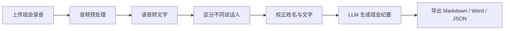

# 会议录音转纪要应用规划

> 版本：v1.0  
> 日期：2026-07-26  
> 当前设备条件：只有一台笔记本电脑  
> 设计原则：笔记本优先、轻量运行、模型可替换、未来可平滑迁移到台式机

## 1. 项目目标

开发一个个人使用的轻量工作流应用，将已有的组会录音自动处理为可编辑、可追溯、可导出的会议纪要。

完整流程：



第一版不自行训练语音模型，而是将成熟的语音识别、说话人区分和大语言模型组合成一套适合个人使用的流程。

## 2. 当前实施策略

由于目前只有笔记本电脑，第一版采用“本地应用 + 可替换计算后端”的设计：

- 应用运行在笔记本电脑上。
- 通过浏览器访问本机地址，例如 `http://127.0.0.1:8000`。
- 不使用 Docker，不对局域网或互联网开放端口。
- 同一时间只处理一个录音任务。
- 语音模型、说话人模型和本地 LLM 顺序运行，避免同时占用内存或显存。
- 转写和 LLM 均支持在“本地模型”和“云端接口”之间切换。
- 所有会议数据保存在可配置的本地目录。

将来拥有台式机后，可以把应用、配置和数据目录整体迁移过去，再启用局域网访问。核心流程不需要重写。

## 3. 第一版功能范围

### 3.1 必须实现

- 上传 MP3、M4A、WAV、MP4 等常见音视频文件。
- 填写会议名称、日期、预计发言人数等信息。
- 自动提取和标准化音频。
- 中文语音转文字，兼容一定程度的中英混合。
- 为不同发言人生成 `SPEAKER_01`、`SPEAKER_02` 等标签。
- 支持把说话人标签批量改成真实姓名。
- 显示带时间戳的逐字稿。
- 支持修改识别错误和说话人归属。
- 支持填写人名、课题名、专业术语和英文缩写。
- 使用固定模板生成组会纪要。
- 导出 Markdown、TXT、DOCX 和原始 JSON。
- 保存处理状态和错误日志。
- 失败任务可以重新处理。

### 3.2 第一版暂不实现

- 实时会议录音和实时字幕。
- 多用户注册、权限与协作。
- 公网访问。
- 手机原生应用。
- 复杂音频剪辑。
- 自动识别真实姓名。
- 跨会议声纹身份匹配。
- 全文知识库和跨会议问答。

## 4. 推荐技术结构

### 4.1 应用层

- 开发语言：Python。
- 后端：FastAPI。
- 页面：Jinja2 + HTMX，保持轻量并避免复杂前端工程。
- 任务处理：单任务后台队列，不引入 Redis、Celery 等额外服务。
- 数据索引：SQLite。
- 会议原始数据：按会议保存为独立文件夹。
- 启动方式：Windows 双击启动脚本，后续可增加桌面快捷方式。

### 4.2 音频预处理

使用 FFmpeg 完成：

- 提取视频中的音轨。
- 统一采样率和声道。
- 检查损坏或不支持的文件。
- 必要时对长录音进行分段。
- 保留原始录音，不覆盖用户文件。

### 4.3 语音识别与说话人区分

候选方案：

1. **FunASR**
   - 优先测试中文语音识别。
   - 可组合语音活动检测、标点恢复和说话人模型。
   - 适合中文组会和专业词汇场景。

2. **WhisperX + pyannote**
   - 作为中英混合识别和时间戳精度的对照方案。
   - 支持说话人区分。
   - 对硬件和部署环境的要求通常更高。

程序内部为语音识别建立统一接口，后续可以切换为其他本地模型或云端服务，而无需修改界面及纪要流程。

### 4.4 LLM 纪要生成

支持两类后端：

- 本地 Ollama 或其他 OpenAI 兼容服务。
- 云端 OpenAI 兼容 API。

如果使用云端 LLM，默认只发送校正后的文字，不上传原始录音。

长会议采用分阶段处理：

1. 按说话段落和时间切分逐字稿。
2. 分段提取事实、决定、行动项和问题。
3. 合并、去重并检查冲突。
4. 生成最终纪要。

## 5. 组会纪要模板

默认纪要包含：

1. 会议基本信息。
2. 会议摘要。
3. 各成员工作进展。
4. 实验结果与数据结论。
5. 导师或组员提出的建议。
6. 已形成的决定。
7. 待办事项。
8. 未解决问题与风险。
9. 下次会议需要跟进的内容。

待办事项使用结构化字段：

```json
{
  "owner": "负责人或未明确",
  "task": "具体任务",
  "due": "截止日期或未明确",
  "evidence_time": "00:42:18",
  "status": "待处理"
}
```

LLM 必须遵循以下约束：

- 不推测未明确的负责人。
- 不虚构截止日期。
- 不把讨论意见错误写成最终决定。
- 重要结论和行动项尽量附带原文时间戳。
- 无法确认的信息明确标记为“未明确”或“待确认”。

## 6. 用户操作流程

1. 启动应用，浏览器自动打开本地页面。
2. 上传组会录音。
3. 填写会议名称、日期、预计人数和专业词表。
4. 选择处理模式：本地、混合或云端。
5. 查看转写进度。
6. 处理完成后试听每位说话人的代表片段。
7. 将说话人编号修改为真实姓名。
8. 校正明显的文字错误或说话人归属错误。
9. 选择“实验室组会”纪要模板并生成纪要。
10. 人工审核纪要。
11. 导出 Word、Markdown、TXT 或 JSON。

## 7. 本地数据结构

```text
meetings/
  2026-07-26_课题组周会/
    original.m4a
    normalized.wav
    meeting.json
    transcript_raw.json
    transcript_edited.json
    speakers.json
    glossary.txt
    transcript.md
    minutes.json
    minutes.md
    minutes.docx
    processing.log
```

其中：

- `transcript_raw.json` 永久保留模型的原始结果。
- `transcript_edited.json` 保存人工修改结果。
- `speakers.json` 保存说话人编号和姓名映射。
- `minutes.json` 保存结构化纪要，方便重新导出不同格式。
- 更换 LLM 或纪要模板时，不需要重新识别录音。

## 8. 笔记本运行模式

具体模式根据笔记本硬件和隐私要求决定：

| 笔记本情况 | 推荐方案 |
|---|---|
| 没有 NVIDIA 独立显卡 | 云端转写与说话人区分，云端或本地 LLM |
| 有一般 NVIDIA 独显 | 本地转写与说话人区分，云端 LLM |
| 显存和内存较充足 | 转写、说话人区分和 LLM 全部本地，依次运行 |
| 录音不能上传第三方 | 使用本地轻量模型，接受更长处理时间 |

笔记本处理长录音时应：

- 接通电源。
- 暂停自动休眠。
- 避免同时运行大型游戏或其他 AI 模型。
- 将模型依次加载和释放。
- 保留足够的 SSD 空间。

## 9. 开发阶段

### 阶段 0：硬件与样本评估

- 获取笔记本 CPU、显卡、显存、内存和 Windows 版本。
- 准备一段 10 至 20 分钟的代表性组会录音。
- 测试本地转写速度、中文准确度和说话人区分效果。
- 确定 FunASR、WhisperX 或云端接口中的首选方案。

预计时间：0.5 至 1 天。

### 阶段 1：核心处理链路

- 上传或读取音频。
- FFmpeg 预处理。
- 语音转写和说话人区分。
- 保存标准化 JSON。
- 调用 LLM 生成 Markdown 纪要。

预计时间：1 至 2 天。

### 阶段 2：本地网页应用

- 文件上传页面。
- 任务进度和历史记录。
- 说话人试听和姓名修改。
- 逐字稿编辑。
- 纪要模板选择。
- Word、Markdown、TXT 和 JSON 下载。

预计时间：2 至 4 天。

### 阶段 3：稳定性与交付

- 失败重试。
- 运行日志。
- 浏览器关闭后继续处理。
- Windows 启动脚本。
- 数据备份和恢复说明。
- 使用文档。

预计时间：1 至 2 天。

首个可运行原型预计需要 2 至 3 个工作日；较稳定的个人版本预计需要 5 至 9 个工作日。实际时间取决于本地模型兼容情况和录音质量。

## 10. 验收标准

- 能处理至少一场完整组会录音。
- 上传大文件时不会把整个文件一次性加载到内存。
- 浏览器关闭后，后台任务仍能继续。
- 任务状态和结果在应用重启后仍然存在。
- 逐字稿包含说话人和时间戳。
- 修改说话人姓名后，全文统一更新。
- 可以纠正转写文字且不会覆盖原始结果。
- 纪要包含摘要、决定、行动项和未决问题。
- 重要行动项能够追溯到原文时间。
- 不编造负责人、截止日期和实验结论。
- 可以成功导出 Markdown、Word 和 JSON。
- 本地模式下不向外部发送录音或转写文字。

## 11. 未来迁移到台式机

拥有台式机后，迁移步骤为：

1. 将应用目录和 `meetings` 数据目录复制到台式机。
2. 在台式机安装模型和运行环境。
3. 修改配置中的数据路径和计算设备。
4. 将监听地址从 `127.0.0.1` 改为局域网地址。
5. 配置 Windows 防火墙，仅允许本地局域网访问。
6. 在笔记本浏览器中访问台式机地址。

迁移后可以进一步增加：

- 全本地大型语音模型。
- 本地中文 LLM。
- 自动监控录音文件夹。
- 声纹档案与说话人身份建议。
- 定时备份。

## 12. 开始开发前需要确认的信息

- 笔记本 CPU 型号。
- 显卡型号和显存容量。
- 内存容量。
- Windows 版本。
- 典型组会时长。
- 通常发言人数。
- 普通话、英语和方言的大致比例。
- 录音是否允许上传第三方云服务。
- 最常用的导出格式。
- 一段可用于测试的代表性录音。

在上述信息确认后，先完成一轮短录音基准测试，再决定第一版默认采用本地、混合还是云端处理方案。

## 13. 当前执行进度

> 更新时间：2026-07-28

已完成首个可运行原型：

- [x] 自动评估本机 CPU、内存、GPU、显存、Python 和 FFmpeg 环境。
- [x] 在项目目录创建独立的 Python 3.11 虚拟环境 `.venv`。
- [x] 创建 FastAPI、Jinja2、SQLite 和单任务后台队列。
- [x] 实现分块上传、格式限制、FFmpeg 标准化和任务日志。
- [x] 建立可替换的转写与纪要后端接口。
- [x] 实现 OpenAI 兼容转写/纪要接口和明确标记的开发模式后端。
- [x] 实现任务历史、持久化进度、失败恢复与重新处理。
- [x] 实现说话人姓名映射、逐段文字及说话人归属编辑。
- [x] 实现 Markdown、TXT、DOCX 和 JSON 导出。
- [x] 完成自动化测试与真实 FFmpeg 端到端烟雾测试。
- [x] 增加 Windows 双击启动脚本和使用说明。
- [x] 取得带 7 人标注的 15 分钟 AISHELL-4 中文会议样本。
- [x] 在项目 `.venv` 中复用并验证 PyTorch 2.6.0+cu124 和 RTX 3060。
- [x] 接入 Paraformer-zh、FSMN-VAD、CT-Punc 和 CAM++ 本地后端。
- [x] 完成 15 分钟 GPU 基准：71.775 秒、12.54 倍实时、峰值显存 2534.6 MB。
- [x] 将预计发言人数传入说话人聚类；样本预测 7 人，与标注一致。
- [x] 将本机默认本地转写后端设为 FunASR，并完成应用级真实转写冒烟测试。
- [x] 复用本机已有的 Qwen3.5 9.2B Q4_K_M 权重，创建项目专用 Ollama 模型 `meetominute-qwen35-9b`。
- [x] 接入独立 Ollama 纪要后端，支持长逐字稿分段、结构化 JSON、事实约束和证据时间戳。
- [x] 完成 15 分钟真实纪要基准：200.625 秒、3 次模型调用、20/20 条证据时间戳有效。
- [x] 将 FunASR 放入独立子进程，并在任务前后卸载 Ollama，解决 6 GB 显存下的 CUDA 资源冲突。
- [x] 完成真实 FunASR + Ollama 应用级整链测试，上传、SQLite、逐字稿及 Markdown、TXT、DOCX、JSON 导出全部成功。
- [x] 将基础网页升级为正式会议工作台，完成上传、历史记录、阶段进度、逐字稿校对、纪要审核和导出界面的系统化重构。
- [x] 增加会议搜索、逐字稿搜索与说话人筛选、未保存提示、证据时间回听和响应式移动端布局。
- [x] 完成 1440 px 桌面端与 390 px 手机端浏览器截图验收，无横向溢出或控制台错误。
- [x] 增加外部 LLM 设置页，支持 OpenAI-compatible API 地址、模型名称、API Key、推理强度和连接测试。
- [x] 使用 Windows DPAPI 加密外部 API Key；页面、状态查询接口、会议文件和日志均不回显密钥。
- [x] 将运行时外部配置接入混合/云端纪要流程，保存后无需重启即可生效，同时保留环境变量兼容。
- [x] 增加逐字稿 TXT 导出，确保导出内容使用最新保存的文本、说话人姓名和时间戳。
- [x] 增加运行诊断中心和 JSON 接口，覆盖虚拟环境、磁盘、SQLite、FFmpeg、CUDA、FunASR 与 Ollama，并提供逐项修复建议。
- [x] 将后台队列升级为 SQLite 持久化阶段任务，支持安全取消、应用重启自动恢复、断点续跑和从头重试。
- [x] 增加会议归档、回收站、精确永久删除、完整 ZIP 备份与合并恢复，并建立 SQLite v1 → v4 版本迁移。
- [x] 增加按实际会议日期组织的月历视图，支持月份切换并区分正常、归档和回收站记录。
- [x] 增加自定义纪要模板中心，支持章节启用、改名、额外章节、专项提取要求、按会议选择以及随备份恢复。
- [x] 完成长会议稳定性加固：支持 600 段以上逐字稿保存、后台任务异常隔离、纪要输入预算与多层归并、备份维护锁和 Windows 自动化测试。
- [x] 增加跨会议全文搜索，覆盖会议信息、说话人、逐字稿和自定义纪要章节，并支持内容范围与生命周期筛选。
- [x] 增加会议待办中心，支持逾期识别、完成/忽略/重新打开、重新生成纪要时保留状态，以及会议详情、日历和导出文件联动。

下一步：

- [ ] 使用真实会议验证说话人区分、专业词表和纪要事实约束。
- [ ] 根据用户会议中的中英混合和方言情况，决定是否增加 Whisper 系列对照后端。

当前本机 `.env` 已启用 `funasr` 转写和 `ollama` 纪要，默认通过项目专用端口 `11435` 使用 `meetominute-qwen35-9b`，实现全本地处理。FunASR 与 Ollama 按顺序加载，任务完成后自动释放模型显存。
